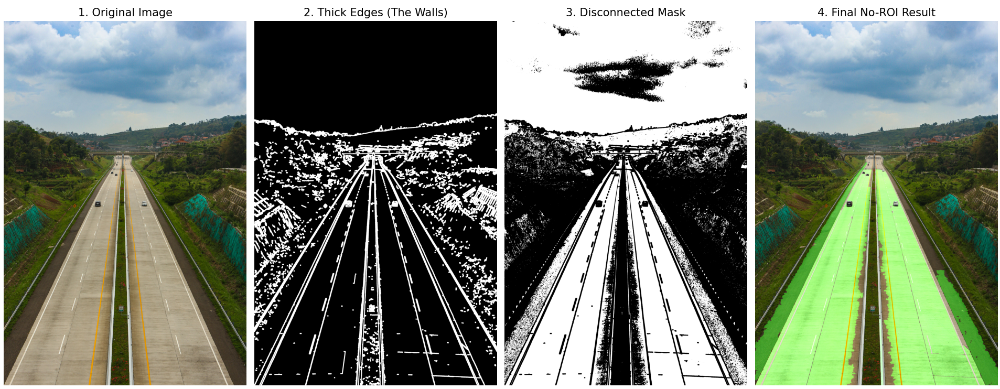
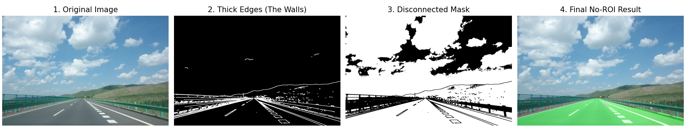
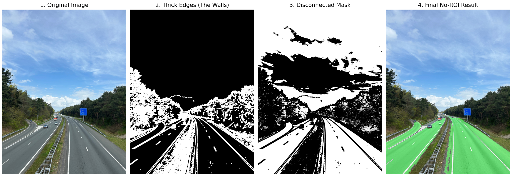
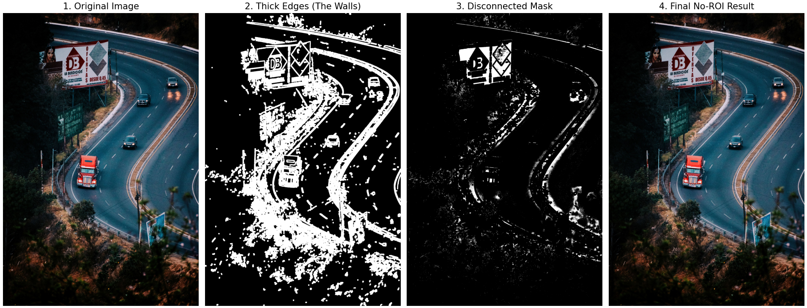

# Road-Segmentation
### 1. 專案概述

實現道路分割的任務。透過影像前處理、特徵提取、邊緣檢測與透視幾何判斷等方法，對輸入的道路影像進行像素級分類，將畫面分割為「道路」與「非道路」兩類。

---

### 2. 實驗目標

本專案的核心實驗目標如下：

* **實現道路分割功能**
* 輸入：一張道路場景影像（RGB）
* 輸出：對應的 segmentation mask（binary image）及可視化注水疊加圖
* 類別 1：道路(綠色區域)
* 類別 0：非道路（非綠色區域）

---

### 3. 流程 (Pipeline)

本版本結合「顏色特徵」、「邊界防波堤」與「空間透視幾何」的動態過濾法：

1. **色彩空間過濾 (HSV Filtering)：** 將原圖轉為 HSV 色彩空間，放寬飽和度與亮度限制，大面積抓取可能為柏油路或水泥路的灰白/偏黃色塊。
2. **建立邊界防波堤 (Edge-Wall Construction)：** 將原圖轉為灰階並進行高斯模糊，使用 Canny Edge Detection 提取畫面中的強烈邊界（地平線、護欄、車道線），並利用形態學膨脹（Dilation）將邊界加粗，形成實體隔離牆。
3. **物理切斷 (Negative Masking)：** 將「步驟 1 的顏色遮罩」扣除「步驟 2 的邊界防波堤」，強制切斷天空、山壁與馬路之間可能存在的顏色黏連。
4. **形態學去噪 (Morphological Operations)：** 進行開運算與閉運算，消除畫面中的細小雜訊並填補馬路內部的孔洞。
5. **空間幾何與根部檢驗 (Spatial & Bottom-Touch Validation)：**
* 利用 `findContours` 找出所有獨立區塊，過濾掉面積過小的風景雜訊。
* **核心防呆：** 檢驗區塊的最底部座標，只有「觸碰到畫面最下緣（大於畫面高度 95%，即車頭正前方）」的巨大區塊，才被判定為真實車道。

6. **結果疊加 (Overlay)：** 將最終確認的馬路區塊進行綠色注水（Alpha Blending），與原圖疊加輸出。

---

### 4. 結果

目前版本的呈現效果如下：

* **成功案例：** 

* **失敗邊角案例 (Corner Cases)：** 仍有部分極端圖片會發生「漏水效應」（如強光導致地平線邊緣消失），或「橋接效應」（雜訊導致天空與馬路相連）或者道路彎曲而造成過度分割。

---

### 5. 優點

1. **無需訓練（Unsupervised）：** 隨插即用，不依賴任何標註資料與耗時的模型訓練。
2. **可解釋性極高（Highly Interpretable）：** 每一個步驟的遮罩、邊界與切斷邏輯皆肉眼可視，極易進行問題排查與除錯。
3. **動態適應地形：** 捨棄固定的 ROI 梯形，靠實體邊界與「底部觸碰規則」自動尋找馬路，不怕車輛上下坡或攝影機點頭。
4. **運算輕量，適合硬體實作：** 僅依賴基礎的閥值判斷、迴積濾波與連通域分析，可在無 GPU 的嵌入式單板電腦上達成高 FPS 即時運算。
5. **多維度特徵過濾：** 結合了顏色（HSV）、紋理（邊緣）與空間常識（透視幾何），抗干擾能力遠勝單純的顏色分群。

---

### 6. 限制

1. **漏水效應 (Leaking)：** 若因為起大霧、過度曝光等原因導致地平線或護欄邊界糊掉，Canny 無法建起「防波堤」，注水會直接溢出淹沒天空。
2. **橋接效應 (Bridge Effect)：** 只要畫面中有極細微的雜訊將馬路與天空連成一氣，底層連通域演算法就容易陷入過度分割。
3. **對環境參數敏感：** 雖然移除了 ROI，但 HSV 範圍與 Canny 的高低門檻值仍需針對日/夜間或特定光線手動微調。
4. **缺乏全局語意理解 (No Semantic Context)：** 無法像神經網路一樣理解「前方是一台白色汽車」，容易將與馬路顏色相近的障礙物或前車陰影誤認為馬路的一部分。
5. **邊緣方塊感：** 由於形態學膨脹與侵蝕的反覆操作，最終 segmentation 的邊界在彎道處可能不夠平滑自然。

---

### 7. 結論

從初版的「區塊特徵分群 (Block-based Clustering)」演進至本版本的「邊界防波堤與空間幾何檢驗 (Edge-Wall & Perspective Validation)」，本專案成功證明了結合**顏色特徵、邊緣物理阻隔與人類空間常識**，能大幅提升傳統 CV 在道路分割上的穩定度與泛化能力。

雖然傳統演算法在面對極端氣候條件與複雜語意遮蔽時，仍存在不可避免的物理極限，但其「極低運算成本」與「100% 可解釋性」依然具備高度價值。